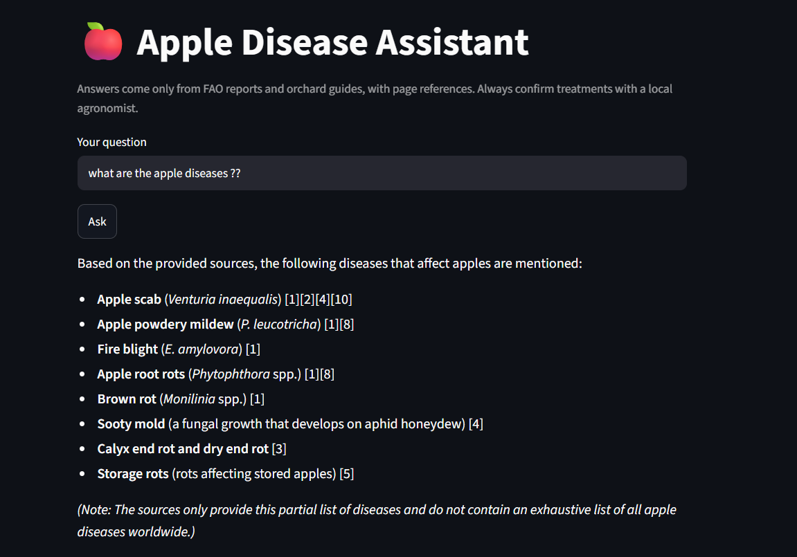
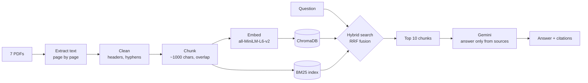

# 🍎 Apple Disease Assistant: a RAG system for farmers

Ask questions about apple diseases in plain language and get answers **grounded in FAO reports and orchard guides, with page-level citations**. The assistant says so when its sources don't contain the answer, instead of inventing one.



## Why RAG?

A general LLM knows a little about everything, can't cite where its facts come from, and sometimes makes them up. **Retrieval-Augmented Generation (RAG)** fixes that: before answering, the system searches a trusted document collection, passes the most relevant passages to the LLM, and instructs it to answer **only** from them, citing each one.

## How it works



| Step | Script | What it does |
|---|---|---|
| 1 | `src/extract.py` | Extracts text from each PDF page, keeping file name and page number |
| 2 | `src/clean.py` | Removes repeated headers and footers, page numbers, and figure labels; rejoins words split by (soft) hyphens |
| 3 | `src/chunk.py` | Splits pages into ~1000-character chunks of whole sentences, with 200-character overlap |
| 4 | `src/build_index.py` | Embeds the chunks and stores them in a ChromaDB vector database |
| 5 | `src/retriever.py` | **Hybrid search**: vector (meaning) + BM25 (keywords), merged with Reciprocal Rank Fusion |
| 6 | `src/answer.py` | Builds a grounded prompt and asks Gemini for a cited answer (retries automatically if the API is busy) |
| 7 | `src/app.py` | Streamlit web interface with expandable sources |
| 8 | `src/evaluate.py` | Measures retrieval quality on a test set |

## Results

I built a 10-question test set (`eval/questions.json`) where the source PDF and a key phrase of each answer are known. A question counts as a hit when a retrieved chunk comes from the right PDF and contains that phrase.

| Retrieval method | Hit@5 | Hit@10 | MRR |
|---|---|---|---|
| Vector search only (baseline) | 80% | 90% | 0.66 |
| **Hybrid: vector + BM25 (RRF)** | **90%** | **100%** | **0.72** |

**What I learned:**
- **Retrieval was the bottleneck, not the LLM.** When the right passage was missing, Gemini correctly answered "the sources don't contain this" instead of inventing an answer. Improving the search improved the answers.
- **Meaning search misses exact names.** "Which varieties are susceptible to apple scab?" was a miss with vectors alone, because the answer hinges on the name "Red Delicious." Keyword search (BM25) found it.
- **Inspect the data at every step.** One PDF used invisible soft hyphens, so words like "bacte-rial" stayed split even though the code ran without errors. It was only caught by looking at the cleaned output.

Raw outputs are in `eval/results_baseline.txt` and `eval/results_hybrid.txt`.

## Run it yourself

Requires Python 3.11 and a free [Gemini API key](https://aistudio.google.com).

```bash
git clone https://github.com/Marzban-io/Apple-disease-RAG.git
cd Apple-disease-RAG
python -m venv .venv
.venv\Scripts\activate          # Windows  (macOS/Linux: source .venv/bin/activate)
pip install -r requirements.txt
```

Copy `.env.example` to `.env` and add your key. Then build the pipeline and start the app:

```bash
python src/extract.py
python src/clean.py
python src/chunk.py
python src/build_index.py
streamlit run src/app.py
```

Other commands:
- `python src/answer.py <question>` asks one question from the terminal.
- `python src/evaluate.py` reruns the evaluation.

## Data sources

| File | Source | License |
|---|---|---|
| `fao_ipm_caucasus.pdf` | FAO (2017), *Integrated pest management of major pests and diseases in eastern Europe and the Caucasus* | CC BY-NC-SA 3.0 IGO |
| `fao_climate_change_pests.pdf` | FAO & University of Bonn (2021), *Climate change impacts on twenty major crop pests in Central Asia, the Caucasus and Southeastern Europe* | CC BY-NC-SA 3.0 IGO |
| `fao_lebanon_apple_losses.pdf` | FAO, post-harvest loss reduction manual for apples in Lebanon (I8148EN) | CC BY-NC-SA 3.0 IGO |
| `mdpi_morocco_apple_climate.pdf` | *Horticulturae* 4(4):42 (2018), farmers' apple pest management and climate change, Morocco | CC BY 4.0 |
| `fire_blight_china.pdf` | *Frontiers in Plant Science*, comprehensive assessment of *Erwinia amylovora* in China | CC BY 4.0 |
| `maine_orchard_pest_mgmt.pdf` | University of Maine Cooperative Extension, *Orchard Fruit Pest Management* | © University of Maine, included for non-commercial educational use |
| `kentucky_apple_scouting.pdf` | University of Kentucky, *An IPM Scouting Guide for Common Problems of Apple in Kentucky* (ID-219) | © University of Kentucky, included for non-commercial educational use |

## Limitations and next steps

- **Small test set.** 10 questions show the direction of improvement, but not a precise score. A larger set (50+) would be more reliable.
- **Coverage gaps.** The sources don't cover every growth stage, for example diseases at petal fall, or per-country loss statistics. The assistant says so instead of guessing.
- **Mixed-topic documents.** The FAO IPM book also covers other crops (onion, wheat…), which can occasionally take up retrieval slots.
- **Possible improvements:** a stronger embedding model, a re-ranker, answer-level evaluation, and deployment to Streamlit Community Cloud.

*This tool supports, but does not replace, advice from a local agronomist.*

## Tech stack

Python · PyMuPDF · ChromaDB · all-MiniLM-L6-v2 (ONNX) · rank-bm25 · Google Gemini API · Streamlit